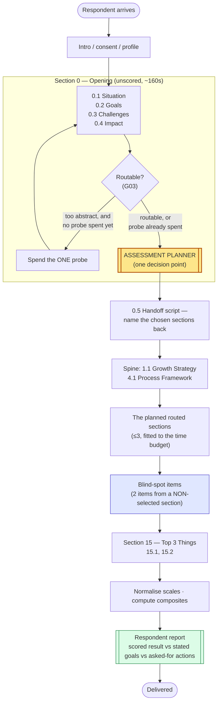
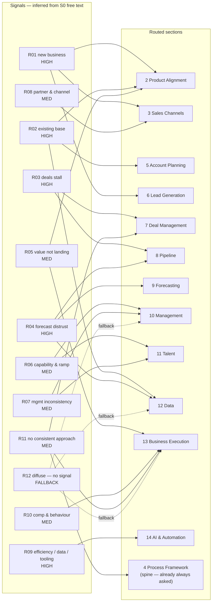
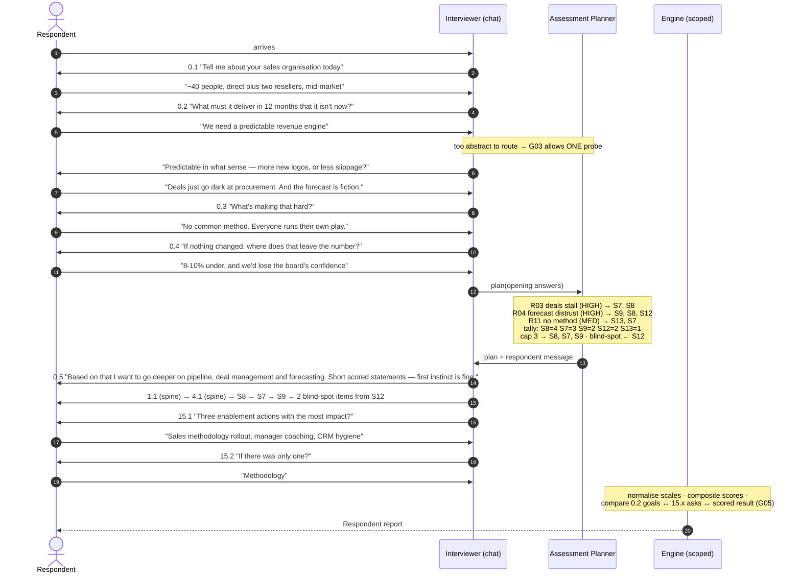
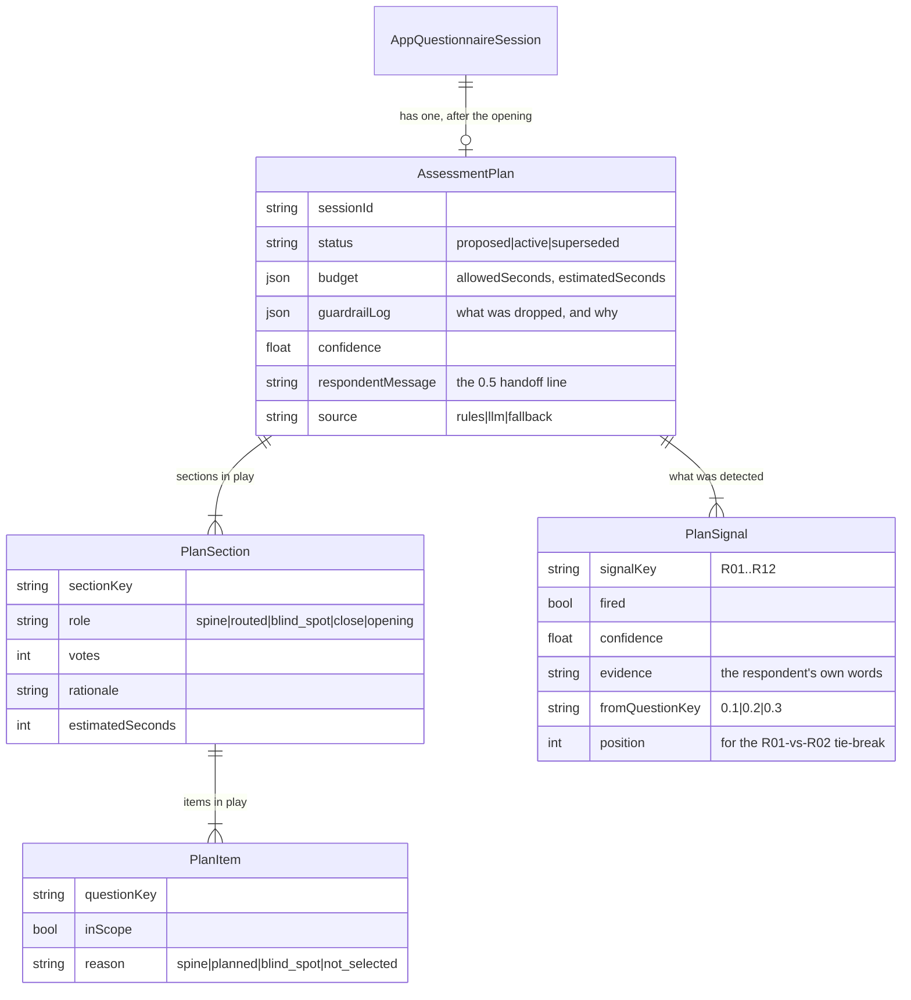
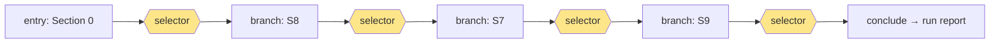

# Merlin5 Growth Assessor — conceptual requirements and solution options

> **Status: research.** This document describes what the client's question set _requires_, in
> ConQuest vocabulary, and lays out the ways we could build it. No code exists for any of it. It is
> deliberately written so the requirements section stands on its own — a reader who never gets to
> the options section still knows what the product has to do.

---

## 1. What the source document actually is

Five tabs. They are not five views of one thing — they are four different kinds of specification
plus an index, and each one lands on a different part of our stack.

| Tab               | Rows                  | What it really is                                            | Where it lands for us                         |
| ----------------- | --------------------- | ------------------------------------------------------------ | --------------------------------------------- |
| **Read Me**       | 19                    | The cascade algorithm, in prose                              | The planner's contract                        |
| **Questions**     | 70                    | The item bank — 50 Likert, 19 free-text, 1 bot script        | `AppQuestionnaireSection` + `AppQuestionSlot` |
| **Routing**       | 12 rules + 1 fallback | Signal → section map, with priority                          | A new signal-to-section routing table         |
| **Guardrails**    | 6 rules               | The constraints that stop the cascade misfiring              | Deterministic post-processing over the plan   |
| **Section Index** | 16 sections           | The **time model** — seconds per item type, 10-minute budget | A budget currency we do not have today        |

The instrument is 16 sections numbered 0–15:

- **Section 0 — Opening.** Four open questions (situation, goals, challenges, impact) plus a bot
  script. Weight `0`, unscored. _Its only job is to produce routing signal._
- **Sections 1 and 4 — the spine.** Always asked. One Likert item each.
- **Sections 2, 3, 5–14 — routed.** Twelve candidates, asked only when selected. 2–9 Likert items
  plus 1–2 free-text each.
- **Section 15 — the close.** Always asked. Two free-text items.

**The critical sentence in the whole workbook** is on the Read Me tab:

> "Ask Section 0. Listen for the signals on the Routing tab — **the respondent is never asked which
> sections to run.**"

That single constraint is what makes this an adaptive diagnostic rather than a branching survey.
There is no "which of these apply to you?" menu anywhere in the design. The instrument infers, from
four open answers, which twelve-of-a-kind sub-assessments are worth the respondent's next six
minutes — and then tells them what it chose and why.

### The time model is load-bearing, not decorative

The Section Index tab is where the "maximum three routed sections" rule comes from. It is not a
round number someone liked:

```
Seconds per Likert item       8
Seconds per free-text item   45
Seconds per opening question 40
Total budget               600s (10 min)

Mandatory floor:  S0 (160) + S1 (8) + S4 (8) + S15 (90)  = 266s
Remaining for routed sections                            = 334s
Cheapest routed section (S6 / S8 / S9)                   =  61s
Most expensive routed sections (S14 117, S11 114, S2 101) = 332s ← exactly fits
A fourth section, even the cheapest                       = 393s ✗
```

The cap of three is _derived_. Which means: **the cap is a consequence of a budget, and the budget
is the thing to model.** If we hard-code "3", a client who says "make it 15 minutes" needs code. If
we model seconds, they need a settings field.

> **Finding worth raising with the client.** Guardrail G04 (the blind-spot check, below) adds two
> Likert items — 16 seconds — that the Section Index does not account for. The worst-case plan
> (S14 + S11 + S2 + blind-spot) comes to 348s against a 334s allowance: ~14 seconds over. Trivial in
> practice, but it tells us the budget arithmetic needs to include the blind-spot items rather than
> treating them as free.

---

## 2. What the client is asking for, as capabilities

Stripped of the sales-diagnostic domain, eleven distinct capabilities are being asked for. This is
the essence — a different client with a different question set would want exactly these.

| #       | Capability                                   | The one-line test of whether we have it                                                                                                                              |
| ------- | -------------------------------------------- | -------------------------------------------------------------------------------------------------------------------------------------------------------------------- |
| **C1**  | **Unscored signal elicitation**              | A section can exist purely to generate routing signal and contribute nothing to the score or to completion                                                           |
| **C2**  | **Semantic signal detection**                | "expansion, cross-sell, renewals, NRR" is recognised as _growth-from-existing-base_ — and the word "AI" alone is explicitly **not** enough to fire the AI rule       |
| **C3**  | **Set-valued plan selection**                | One decision point picks a **set** of up to N sections, not one next thing                                                                                           |
| **C4**  | **Transparent handoff**                      | The chosen set is named back to the respondent in their language before it runs                                                                                      |
| **C5**  | **Scoped delivery**                          | Only the planned items are asked; the unplanned ones do not count against coverage, completion, progress or the report                                               |
| **C6**  | **Sub-section item injection**               | Two items from a _non-selected_ section can be carried into the plan without carrying the section                                                                    |
| **C7**  | **Time as a budget**                         | Item-level time estimates, a session ceiling, and a planner that fits the plan to the remaining seconds                                                              |
| **C8**  | **Normalised composite scoring**             | 1–5 and 1–6 scales are normalised before any cross-section comparison; a "cannot assess" answer is excluded from a mean rather than counted as zero or as unanswered |
| **C9**  | **Open-vs-close reconciliation**             | The report explicitly compares what they _said they needed_ (0.2) with what they _asked for at the end_ (15.1/15.2) and with what the _scores_ show                  |
| **C10** | **Report scoped to what was actually asked** | The respondent report reasons only over the sections that ran, and says plainly which it did not assess                                                              |
| **C11** | **Decision auditability**                    | Months later, an admin can answer "why did this respondent get those three sections?" with evidence, not a guess                                                     |

### Where each capability stands today

| Cap | Status         | Detail                                                                                                                                                                                                                                               |
| --- | -------------- | ---------------------------------------------------------------------------------------------------------------------------------------------------------------------------------------------------------------------------------------------------- |
| C1  | ✅ **Have it** | `AppQuestionSlot.weight = 0` drops a question out of the weighted coverage denominator entirely (`weightedCoverage`, `selection/context.ts:93`)                                                                                                      |
| C2  | ⚠️ **Half**    | The data-slot extractor already reads free text semantically into named slots. What is missing is _negative_ constraints ("do not fire on the bare word AI") and evidence capture                                                                    |
| C3  | ❌ **Missing** | `selectNextStep` returns exactly one `selectedStepKey`. Every routing surface we have is single-valued                                                                                                                                               |
| C4  | ⚠️ **Half**    | `RoutingDecision.respondentMessage` is exactly this idea, for one destination. It needs to speak about a set                                                                                                                                         |
| C5  | ❌ **Missing** | No conditionality exists _inside_ a questionnaire. No `showIf`, no `dependsOn`, no eligibility. Coverage, completion, the answer panel, cost estimation and exports all assume every slot in the version is in play                                  |
| C6  | ❌ **Missing** | Routing today is section-granular at best (a whole step). Nothing selects _items_                                                                                                                                                                    |
| C7  | ❌ **Missing** | We budget in **USD** (`costBudgetUsd` per session, per run) and in question count (`maxQuestionsPerSession`). We do not model time                                                                                                                   |
| C8  | ⚠️ **Half**    | `AppScoringSchema` has scales, weighted items, reverse-scoring and bands. `ItemBounds` is already loaded per item for reverse-scoring — so 0–1 normalisation is a small, contained addition. Cross-**version** aggregation is the hard part (see §6) |
| C9  | ⚠️ **Half**    | The report pipeline takes pre-assembled inputs (`generateReportFromInputs`), so this is an inputs + prompt change, not a new pipeline                                                                                                                |
| C10 | ✅ **Have it** | `buildUnansweredQuestionsBlock` already fences what was not answered. It needs to distinguish _not asked_ from _not answered_                                                                                                                        |
| C11 | ✅ **Have it** | `recordAiRun({ kind: 'experience_routing' })` already snapshots every routing decision — prompt, output, confidence, rationale, candidate set — including deterministic ones                                                                         |

**Read that table as the scope estimate.** Three genuine gaps (C3, C5, C6), one new currency (C7),
and four half-built things that need extending rather than inventing.

---

## 3. The flows

### 3.1 End-to-end journey



### 3.2 The Assessment Planner — the one genuinely new component

Everything else in this document is plumbing around this box. It runs **once** per session,
immediately after the opening, and it is the only place the instrument makes a judgement about a
person.

```mermaid
flowchart TD
    IN["Opening answers<br/>(4 open, free text)"] --> SIG

    subgraph DETECT["1 · Signal detection"]
        SIG["Extract signals into named slots<br/>growth_source · deal_health · forecast_trust ·<br/>value_landing · capability · management ·<br/>channel · efficiency_and_tooling · comp_behaviour ·<br/>method_consistency · commercial_outcome_named"]
        SIG --> EV["Each signal carries:<br/>fired? · confidence · evidence span · which question it came from"]
    end

    EV --> RULES

    subgraph PROPOSE["2 · Proposal"]
        RULES["Deterministic rule pass<br/>R01–R12 · signal → weighted section votes"]
        RULES --> ENOUGH{"Clear winner set?"}
        ENOUGH -- yes --> TALLY["Tally votes by priority<br/>High = 2 · Medium = 1"]
        ENOUGH -- "no / ambiguous" --> LLM["LLM planner call<br/>sees the opening text + the tally +<br/>each section's 'choose when' criteria"]
        LLM --> TALLY
    end

    TALLY --> GUARD

    subgraph GUARD["3 · Guardrails (deterministic, always run)"]
        G02{"G02 · S14 proposed but<br/>no commercial outcome named?"} -- yes --> DROP14["Drop S14"]
        G02 -- no --> G01
        DROP14 --> G01
        G01["G01 · cap the set at 3"]
        G01 --> FIT["C7 · fit to remaining seconds<br/>drop the lowest-voted section that does not fit"]
        FIT --> G04["G04 · pick blind-spot section<br/>from the NON-selected set<br/>prefer S12 Data, then S10 Management"]
        G04 --> R12{"Empty set?"}
        R12 -- yes --> FALLBACK["R12 fallback<br/>S13 · S12 · S10"]
        R12 -- no --> PLANOUT
        FALLBACK --> PLANOUT
    end

    PLANOUT[["THE PLAN<br/>sections · items · blind-spot items ·<br/>per-section rationale · est. seconds · confidence"]]
    PLANOUT --> MSG["Respondent message (0.5)"]
    PLANOUT --> AUDIT["AppAiRun snapshot<br/>signals · votes · guardrails applied · what was dropped and why"]

    style PLANOUT fill:#fde68a,stroke:#b45309,stroke-width:2px
    style GUARD fill:#fee2e2,stroke:#b91c1c
```



Two things about this shape are deliberate, and both are lifted from `selectNextStep`
(`lib/app/questionnaire/experiences/routing/select.ts`), which already works this way in production:

1. **Deterministic first, LLM second, deterministic guardrails last.** The model _proposes_; it
   never gets the final say on a hard constraint. Trusting a model to obey six numbered guardrails
   in a single prompt is the classic way to get a plan with four sections in it.
2. **It must never throw.** A respondent is sitting at the end of the opening waiting. Every failure
   path — model down, malformed JSON, low confidence, no signal at all — resolves to R12's fallback
   plan (Business Execution, Data, Management), not to an error.

### 3.3 The signal → section map (Routing tab, as a graph)



Three structural facts fall out of drawing it:

- **It is many-to-many.** S12 Data is a target of R02, R04 and R12; S13 of R05, R10, R11 and R12.
  This is **not** a first-match-wins table — a respondent who trips R04 and R02 has voted for S12
  twice, and that should beat a section with one vote. The evaluation has to be a **tally**, which
  is why our existing `AppExperienceRoutingRule` (one rule → one target, first match wins) does not
  model it.
- **R01 and R02 are mutually exclusive in practice**, with an explicit tie-break: _"if both appear,
  take the one they named first."_ That is an ordering constraint _within a single free-text
  answer_ — the detector has to record where in the answer each signal appeared, not just that it
  did.
- **R11 targets Section 4**, which is spine and therefore always asked anyway. Harmless, but it
  means the tally must not "spend" one of its three routed slots on a section that is not routable.

### 3.4 What the respondent experiences



Note what happens at step 24 in that example: they _asked for_ a methodology rollout, while the
blind-spot items on Data may well have scored badly. **G05 says that disagreement is the most
valuable output the tool produces.** It is a report requirement, and it is the reason the blind-spot
check exists at all.

### 3.5 The plan as an artifact



The plan being a **persisted artifact** rather than a set of booleans on question rows is what buys
C11 (auditability), C10 (a report that knows what it did not ask), and the ability to explain a
decision to a client six months later. It is also what makes the whole thing re-derivable: if we
change the rules, we can replay old openings against the new planner and diff the plans.

---

## 4. The guardrails, as executable rules

The Guardrails tab is prose. Here it is as things a system does, because the difference between
"G01: cap at three routed sections" and _where in the pipeline that cap is applied_ is most of the
engineering.

| ID      | Prose rule                                             | As a mechanism                                                                                                                                                                   | Where it runs                                                               |
| ------- | ------------------------------------------------------ | -------------------------------------------------------------------------------------------------------------------------------------------------------------------------------- | --------------------------------------------------------------------------- |
| **G01** | Cap at three routed sections                           | Truncate the vote-ordered set at N (config, default 3), _after_ G02 has vetoed                                                                                                   | Planner, guardrail stage                                                    |
| **G02** | S14 needs a business outcome attached                  | A **veto predicate** on a route: `commercial_outcome_named` must have fired. Without it, drop S14 even if R09 fired strongly                                                     | Planner, guardrail stage — **before** the cap, so dropping S14 frees a slot |
| **G03** | One probe maximum across the whole opening             | A session-scoped probe budget (default 1), spent only when a `routable?` classifier says the answer cannot be routed. Explicitly _not_ spent when the answer is already routable | Opening loop, per turn                                                      |
| **G04** | Blind-spot check — 2 items from a non-selected section | Item-level injection: choose one non-selected section (prefer S12, then S10), take its 2 highest-weight Likert items                                                             | Planner, guardrail stage                                                    |
| **G05** | Compare close against opening                          | A report input: `{ statedGoal (0.2), askedForActions (15.1/15.2), scoredResult, planCoverage }` plus a prompt instruction to surface disagreement                                | Report assembly                                                             |
| **G06** | Scale mismatch — normalise before any composite        | Per-item normalisation to 0–1 using the item's own bounds, before combining. S14 is 1–6; everything else 1–5                                                                     | Scoring                                                                     |

**G02 deserves a second look**, because it is the most interesting rule in the workbook and the one
most likely to be mis-implemented. It is not a trigger, it is a **veto**: R09 says _route to
Section 14 when they mention admin burden, capacity, CRM, "our AI plan"_. G02 says _…unless they
cannot name a commercial outcome they want it to move_. The stated reason is worth quoting in full
because it is a product insight, not a technical one:

> "Scoring nine foundation statements for someone with no underlying problem produces a low score
> and a recommendation they did not need."

Any routing architecture we choose has to have somewhere to put a rule of the shape _"route to X
only if Y is also true"_. Our current `AppExperienceRoutingRule` cannot express it — one slot, one
operator, one value, first match wins.

---

## 5. The item bank — details that will bite

Things in the Questions tab that a naive ingest would get wrong.

| Observation                                                                                                                 | Why it matters                                                                                                                                                                                                                                                                                                                                                |
| --------------------------------------------------------------------------------------------------------------------------- | ------------------------------------------------------------------------------------------------------------------------------------------------------------------------------------------------------------------------------------------------------------------------------------------------------------------------------------------------------------- |
| **Weight is `0` for Section 0 and `0.5` for everything else.**                                                              | Uniform 0.5 means weight carries no discrimination in v3 — every scored item is equal. Our `AppQuestionSlot.weight` defaults to exactly `0.5` on a 0.1–1.0 scale, so the mapping is 1:1. But `0` is outside our admin slider's range, and `0` is precisely what makes Section 0 unscored. Needs either a slider that reaches 0 or an explicit "unscored" flag |
| **`REQUIRED = yes` on every routed item.**                                                                                  | Required is _conditional on selection_. An unselected section's items are required-if-asked. This is the single clearest argument that scope must be first-class rather than a filter applied at render time — the completion gate reads `required`                                                                                                           |
| **Section 14 permits blanks**, "excluded from the section average".                                                         | A genuine third answer state: _cannot assess_, distinct from _unanswered_. Both scoring and coverage need to know about it                                                                                                                                                                                                                                    |
| **Section 14 is 1–6; everything else is 1–5.**                                                                              | G06. Also note 2.7 is 1–5 but with _confidence_ anchors, not _extent_ anchors — same range, different semantics, which matters for how the interviewer phrases it and how the report narrates it                                                                                                                                                              |
| **The "comments" item is not boilerplate.**                                                                                 | S2/3/5/6/8/9/12/13 use "Please provide comments to support your scores"; S7 asks "What sales methodology do you use and is it valuable?"; S10 asks "How could your sales manager support you?"; S11 has two distinct free-text items. Do not collapse them into one template                                                                                  |
| **Row 68's question number is `14.1`, duplicating item 14.1.**                                                              | It is `14.10`, stored by Excel as the number 14.1. Ingestion must key on the `KEY` column (`ai_automation_comments`), never the question number                                                                                                                                                                                                               |
| **0.5 is `TYPE = Script`** — a bot utterance, not a question.                                                               | We have no `script` question type, and should not add one. This is the planner's `respondentMessage`, generated with the chosen section titles interpolated — not a slot with an answer                                                                                                                                                                       |
| **The workbook's `TAGS` column** carries `routing:situation`, `routing:goals`, `routing:challenges`, `stake`, `transition`. | Maps cleanly onto `AppQuestionTag`, and is how the planner knows which answers are routing inputs                                                                                                                                                                                                                                                             |

**On ingestion:** `flattenWorkbook` (`lib/app/questionnaire/ingestion/xlsx-flatten.ts`) already
renders every tab as Markdown tables for the extractor, so the Questions tab will extract into
sections and slots essentially as-is. The Routing, Guardrails and Section Index tabs are _not_
questions — they are configuration. The extractor will need either explicit instruction to ignore
them, or (better, later) a second pass that reads them into the routing table. For the first build,
author the routing config by hand; it is 12 rules.

---

## 6. The one constraint that shapes everything

From `.context/app/planning/features/f15-followups.md`, recording why experience-wide synthesis
had to read finished step reports rather than raw sessions:

> `buildCohortDataset` resolves everything by a single `versionId` and `buildDataSlots` joins fills
> by `dataSlotId` — the row id, not the key — so fills from another version find no bucket and are
> **silently dropped**. […] a naive cross-step scope would emit a confident, well-formatted report
> over a fraction of the data, with no error and no warning.

The same is true of scoring: `buildScoringInputs(versionId)` is version-scoped by construction, and
`AppScoringSchema` is `versionId @unique`.

**Therefore: any architecture that puts the sections in different questionnaire versions cannot
produce a composite score across them with the pipeline we have.** Not "would be harder" — would be
silently wrong, which is worse. This is the fact that decides between the options below.

---

## 7. The options

### Option A — An Experience of sub-questionnaires

One questionnaire per section. Section 0 is the `entry` step; each routed section is a `branch`
step; the existing switcher forks after each leg.



**What we would get for almost nothing.** Deterministic rules, LLM selector, confidence floor,
fallbacks, carry-over between legs, run-level budget, run-level respondent report across all legs
(`report/run-report.ts`), per-decision `AppAiRun` audit, a stable `/x/<publicRef>` URL and a
`stitched` continuity mode that makes the seams invisible. All shipped, all tested.

**What breaks.**

- **The selector picks one thing at a time.** Three routed sections means **three sequential
  forks** — three selector LLM calls, three submits, three `after()` handoffs, three session
  creations. Against a 10-minute conversation with 334 seconds of routed content, the seam cost is
  the product.
- **It cannot announce the plan.** Script 0.5 names all three sections up front. A switcher that
  decides the second section only after the first has finished cannot say that sentence, and the
  sentence is a stated requirement — it is what "proves the bot listened".
- **No composite score.** §6. Twelve sections, twelve versions, twelve scoring schemas, no
  cross-section normalised composite. The report would be a synthesis of per-leg reports.
- **Two small holes to patch.** `advanceExperienceRun` rebuilds the candidate list from _all_ branch
  steps on every fork, with no memory of what has run — so a run can revisit a section — and there
  is no leg cap other than the USD budget. Both are small fixes; neither exists today.
- **The spine is absurd.** Sections 1 and 4 are _one Likert item each_. As standalone
  questionnaires they get their own session, their own greeting, their own submit.
- **It does not scale to combinations.** If anyone suggests pre-building the combined
  sub-questionnaires instead of forking three times: 12 choose 3 is **220** questionnaires.

**Verdict.** The fastest possible demo — days, not weeks — and genuinely the right shape if the
client's real requirement turns out to be _"route between a handful of separate assessments"_. It is
the wrong shape for _this_ instrument, because this instrument is one instrument.

---

### Option B — Scoped delivery inside one questionnaire (eligibility flags)

All 70 items in one version. After the opening, mark which sections are in play for this session;
the engine only offers in-scope items.

**What this fixes immediately.** One session, one transcript, one version → composite scoring works,
the report is coherent by construction, there are no seams and no handoff latency, and the 10-minute
budget becomes achievable. The spine is just two items in the same conversation.

**The cost is breadth, not depth.** The change itself is small — filter the candidate pool. But
"every question in this version" is currently assumed by:

| Surface               | File                                                     | What changes                                                                             |
| --------------------- | -------------------------------------------------------- | ---------------------------------------------------------------------------------------- |
| Selection strategies  | `selection/context.ts`, `strategies/*`                   | `SelectionContext.questions` becomes the in-scope set                                    |
| Coverage / completion | `selection/context.ts`, `completion/completion-logic.ts` | Denominator is the in-scope set; `required` only binds in scope                          |
| Data-slot targeting   | `orchestrator/data-slot-orchestrator.ts`                 | The unfilled-slot pool is scope-filtered                                                 |
| Answer panel          | `panel/answer-panel.ts`                                  | Shows the plan, not the bank — otherwise the respondent sees 70 questions and 20 answers |
| Cost estimation       | `cost-estimation/`                                       | Estimate the plan, not the version                                                       |
| Exports               | `export/*`                                               | A blank cell must read _not asked_, not _not answered_                                   |
| Report                | `report/content.ts`                                      | `buildUnansweredQuestionsBlock` must distinguish not-asked from not-answered             |
| Scoring               | `scoring/compute.ts`                                     | Section means over asked items only; normalise bounds; honour "cannot assess"            |

Eight touch points is real work, but note what it _is_: threading one filter through surfaces that
all already take a question list. There is no new engine, no new session shape, no migration risk.

---

### Option C — Option B, with the plan as a first-class artifact ★ recommended

Identical runtime to B. The difference is that the scope is a **persisted, explained, replayable
plan** (§3.5) rather than booleans.

**Why the artifact is worth its own table.**

- **C11 auditability.** "Why did this respondent get those three sections?" answers itself, with the
  respondent's own words as evidence, and the guardrail log showing what was dropped and why.
- **C10 report honesty.** The report can say _"we did not assess Talent or Channels"_ because
  something recorded that decision. Absence of an answer cannot tell you that.
- **G05 comes free.** The plan holds the stated goal, the detected signals, and the section set; the
  report compares them against the close and the scores.
- **Replay.** Change the rules, re-run the planner over historic openings, diff the plans. This is
  how the client tunes an instrument, and it is impossible if scope is a transient filter.
- **It generalises.** A plan is "the set of items in play for this session, and why". Every future
  client with conditional questions wants exactly that object — this is the reusable primitive, and
  it belongs in `lib/app/questionnaire/plan/`.

**New components, in dependency order.**

1. `plan/time-model.ts` — seconds-per-type constants and a section estimator. Module constants, not
   config, exactly as `cost-estimation` does with its token constants. No migration.
2. `plan/signals.ts` — the signal vocabulary and detector. Emits fired/confidence/evidence/position.
   Either a new capability sibling to `extract_answer_slots`, or — the cheaper first cut — a set of
   **data slots** whose `description` is the "listen for" list, so the existing extractor fills them
   with no new capability at all.
3. `plan/rules.ts` — the vote tally. Signals → weighted section votes (High = 2, Medium = 1),
   with the R01/R02 first-mentioned tie-break.
4. `plan/guardrails.ts` — pure functions: veto (G02) → cap (G01) → time fit (C7) → blind-spot (G04)
   → fallback (R12). Pure and exhaustively unit-testable, which is the point of separating them
   from the LLM call.
5. `plan/planner.ts` — orchestrates 1–4 plus an optional LLM proposal. Modelled directly on
   `selectNextStep`: never throws, records an `AppAiRun`, logs cost, resolves every failure to the
   fallback plan.
6. `AppSessionPlan` (+ rows) — the artifact. Written once at the end of the opening.
7. The scope thread through the eight surfaces from Option B.
8. Scoring: 0–1 normalisation (`ItemBounds` is already loaded — small) and a _cannot assess_ value.

**The honest cost.** This is a phase, not a feature — comparable in size to P15 itself. Roughly:
planner + guardrails + signals is one PR-sized chunk; the scope thread is another; scoring and
report are a third; admin authoring for the routing table is a fourth.

---

### Option D — The composite posture (how A and C coexist)

Not a third way of building this instrument — the rule for _where routing lives_:

> **Within one instrument, route with a plan (C). Between different instruments, route with an
> Experience (A).**

The Experience switcher stays exactly what it is and is documented as: an opening questionnaire,
then an AI decision to conclude or continue into a chosen follow-up. That is genuinely a different
question from "which of my own sections apply to you", and conflating them is what makes both
awkward. If Merlin5 later wants _"…and if they score badly on Data, hand them into the separate
Data Maturity assessment"_, that is a switcher branch off a completed Growth Assessor run, and it
works today.

---

### Option E — Synthesise a per-respondent version (rejected)

Compose a bespoke `AppQuestionnaireVersion` per respondent from a bank, then run it as an ordinary
session.

**Why not.** A version per respondent needs a scoring schema per respondent (`versionId @unique`),
pollutes every version-scoped admin surface, makes cohort analysis meaningless (every session a
different version — see §6), and is the same idea as the `merged` continuity mode that
`f15-followups.md` explicitly recommends never building. Listed so it is on record as considered.
The plan in Option C is the same expressiveness without materialising a version.

---

### Comparison

|                                    | **A** Sub-questionnaires | **B** Eligibility flags | **C** Plan artifact ★   | **E** Synthesised version |
| ---------------------------------- | ------------------------ | ----------------------- | ----------------------- | ------------------------- |
| Time to a working demo             | **Days**                 | Weeks                   | Weeks+                  | Weeks                     |
| New primitives needed              | 2 small                  | 1 medium                | 1 phase                 | 1 phase + migrations      |
| Fits the 10-minute budget          | ✗ 3 handoff seams        | ✓                       | ✓                       | ✓                         |
| Can announce the plan (0.5)        | ✗                        | ~                       | ✓                       | ✓                         |
| Composite score across sections    | ✗ §6                     | ✓                       | ✓                       | ✗ §6                      |
| Blind-spot items (G04)             | ✗                        | ~                       | ✓                       | ✓                         |
| Veto rules (G02)                   | ✗                        | ~                       | ✓                       | ~                         |
| "Why these sections?" auditable    | ✓ per fork               | ✗                       | ✓                       | ✗                         |
| Report knows what was _not_ asked  | ~                        | ~                       | ✓                       | ✗                         |
| Cohort analysis across respondents | ✗                        | ✓                       | ✓                       | ✗                         |
| Authoring a second assessor        | 15 questionnaires        | 1 + rules               | 1 + rules               | 1 + rules                 |
| Blast radius on shipped code       | none                     | 8 surfaces              | 8 surfaces + new module | large                     |

**Recommendation: C, under the D posture.** Build the plan as a first-class artifact inside a single
instrument, and keep the Experience switcher for routing between instruments.

**If a demo is needed before that lands**, A is worth doing deliberately and throwing away — it
proves the signal detection and the routing table against real answers, which is the part most
likely to need tuning, and that tuning transfers to C unchanged. Do not let it become the product:
the composite score and the 10-minute budget are both casualties, and both are things the client is
selling.

---

## 8. Where the data slots go

John's note — _"we will be creating the experience by abstracting the data slots in the usual way"_ —
lands differently in different parts of this instrument, and the difference is worth being explicit
about.

| Layer                    | Data slots?                                | Why                                                                                                                                                                                                                                                                                                           |
| ------------------------ | ------------------------------------------ | ------------------------------------------------------------------------------------------------------------------------------------------------------------------------------------------------------------------------------------------------------------------------------------------------------------- |
| **Section 0 (opening)**  | **Yes, heavily.**                          | Four open questions is exactly the shape data slots are for. `situation`, `growth_goal`, `blocker`, `stake` — the conversation targets them naturally and the extractor fills them from free-flowing speech                                                                                                   |
| **Signals**              | **Yes — and this is the cheap first cut.** | A signal _is_ a data slot whose `description` is the "listen for" list. Modelling them this way means the existing extractor does the detection and the routing rules read familiar keys. The upgrade path (a dedicated detector with evidence spans and negative constraints) is a swap behind the same keys |
| **Routed Likert items**  | **No.**                                    | Fifty scored statements on a shared anchor set are not slots to abstract over. The interviewer batches them ("quick answers are fine, first instinct is usually right" — script 0.5 says so explicitly), and `answerFitMode` already maps a free-form reply onto a 1–5 choice                                 |
| **Per-section comments** | **Yes, one per section.**                  | "Please provide comments to support your scores" is a data slot: _their account of why the section scored as it did_                                                                                                                                                                                          |
| **Section 15 (close)**   | **Yes.**                                   | `recommended_actions` and `single_highest_impact_action` are semantic targets, and G05 needs them as structured values to compare against the goal and the scores                                                                                                                                             |

The general shape: **data slots where the instrument wants meaning, question slots where it wants a
number.** This instrument wants both, in the same session — which is another argument for one
version rather than fifteen.

---

## 9. The respondent report

Not in the workbook; stated as a requirement. Most of it exists.

**Already there.** `generateReportFromInputs` takes pre-assembled transcript, data-slot context,
coverage and unanswered material; KB grounding, optional web-search rounds, the report agent, the
formatter, the appendix pass and the method record all apply unchanged. `AppRespondentReport` is
already polymorphic over session and experience-run subjects.

**What this instrument adds.**

1. **Plan-aware inputs.** The transcript is only the sections that ran; the "not covered" block must
   say _not assessed_ and name the sections, not list 40 unanswered questions.
2. **Normalised section scores** (G06) with band labels, plus the blind-spot section flagged as
   _partially assessed on two items_ — a two-item read is a signal, not a score, and the report must
   not present it as one.
3. **The G05 comparison**, as an explicit report section. Three inputs, one instruction: what they
   said they needed (0.2) · what they asked for (15.1, 15.2) · what the scores show. _Where these
   disagree, say so plainly and lead with it._ The workbook calls this "the most valuable output the
   tool produces", and it is the thing the report should open with.
4. **A method note the respondent can read** — which sections were selected, and in their own words
   why. The transparency of script 0.5 should survive into the artifact.

---

## 10. Open questions for the client

1. **Is the 10-minute budget a promise or an aspiration?** It determines whether the section cap is
   hard-coded or fitted. Our recommendation is fitted, with 10 minutes as the default setting.
2. **The blind-spot section is one section's two items. Is the _choice_ of which non-selected
   section fixed** (G04 says prefer Data or Management) **or should it be the highest-voted section
   that missed the cut?** The latter is more informative; the former is more predictable.
3. **What is the composite?** The workbook defines section averages and G06 requires normalisation,
   but never states an overall score. Is there a headline Growth Assessor number, or only section
   scores? If there is one, is it a mean over _asked_ sections — which makes two respondents'
   headline numbers non-comparable, since they answered different sections?
4. **Who is the respondent?** Several items are worded for a salesperson ("How could your sales
   manager support you?", 10.4) while the opening is worded for a leader ("your sales
   organisation", "the number"). If both audiences run it, item wording needs to vary by role —
   which is a second, orthogonal axis of conditionality worth knowing about now rather than later.
5. **Is a single respondent the unit, or a cohort?** Multiple people from one company running it
   turns this into a cohort report with per-section divergence, which we have (`AppCohortReport`) —
   but it needs the same version across respondents, which is another vote for one instrument.
6. **How much probing during the routed sections?** The workbook is silent. The scored items are
   meant to be fast ("first instinct"), but the per-section comments are where the real content is,
   and our interviewer will probe them by default.
7. **Should the respondent be able to override the plan?** "The respondent is never asked which
   sections to run" is unambiguous for the _selection_. It says nothing about whether someone who
   says _"actually, ask me about talent"_ mid-run should be honoured. Recommendation: honour it,
   record it on the plan as a respondent amendment, and exclude it from routing-quality analytics.

---

## 11. Risks

| Risk                                                                                                                                                                                                        | Why it matters here                                                                                                                                           | Mitigation                                                                                                                                                                    |
| ----------------------------------------------------------------------------------------------------------------------------------------------------------------------------------------------------------- | ------------------------------------------------------------------------------------------------------------------------------------------------------------- | ----------------------------------------------------------------------------------------------------------------------------------------------------------------------------- |
| **Signal detection is the whole product.** Everything downstream is deterministic; if the detector mis-reads the opening, the respondent gets three irrelevant sections and the report is confidently wrong | R09's own note warns against the obvious failure ("do NOT trigger on the word AI alone"), which tells us the client has already been burned by naive matching | Evidence spans on every fired signal; the confidence floor and the R12 fallback that already exist in `selectNextStep`; a replay harness over recorded openings before launch |
| **Silent cross-version data loss**                                                                                                                                                                          | §6 — a cross-version report or score emits confidently over a fraction of the data with no error                                                              | Choose an architecture where sections share a version (B/C/D). If A is used for a demo, say out loud that its scores are per-section only                                     |
| **Scope leaking into surfaces we forgot**                                                                                                                                                                   | A respondent seeing "12 of 70 answered" after a complete run destroys confidence in the instrument                                                            | Enumerate the eight surfaces (§Option B) as a checklist; a test that asserts every question-list consumer takes the scoped set                                                |
| **Guardrails drifting into the prompt**                                                                                                                                                                     | Six numbered rules in a system prompt will be obeyed most of the time, which is the worst failure mode — plausible plans that quietly break G01 or G02        | Guardrails are pure functions applied _after_ the model, never instructions to it                                                                                             |
| **Three sections is three chances to be wrong**                                                                                                                                                             | Unlike a single next-question choice, a bad plan wastes the respondent's whole session and cannot be recovered mid-run                                        | Announce the plan (0.5) — it is not just courtesy, it is the respondent's chance to object before six minutes are spent                                                       |
| **The instrument will change**                                                                                                                                                                              | v3 already implies v1 and v2; sections were renumbered, Section 0 was added                                                                                   | Version the routing table with the questionnaire version, exactly as tags and data slots already fork (`copyVersionGraph`)                                                    |

---

## 12. Summary

The client has specified an **adaptive diagnostic**: a fixed item bank, an unscored opening that
exists only to generate signal, an inference step that assembles a per-respondent subset under a
time budget and six guardrails, and a report whose most valuable output is the _disagreement_
between what the respondent said they needed and what their scores show.

We have most of the parts. We have semantic extraction from free text, a rules-then-LLM-then-
fallback routing pattern with confidence floors and full audit, scoring schemas with weights and
bands, and a report pipeline that takes assembled inputs. What we do not have is **a per-session
notion of which questions are in play** — and everything genuinely new in this build follows from
adding one: the planner that computes it, the guardrails that constrain it, the time budget that
sizes it, and the scope filter that makes the rest of the engine honour it.

The recommended shape is one instrument, one session, one version, and one persisted **Assessment
Plan** that says which items are in play and why — with the Experience switcher kept for what it is
already good at: routing between _different_ instruments.
